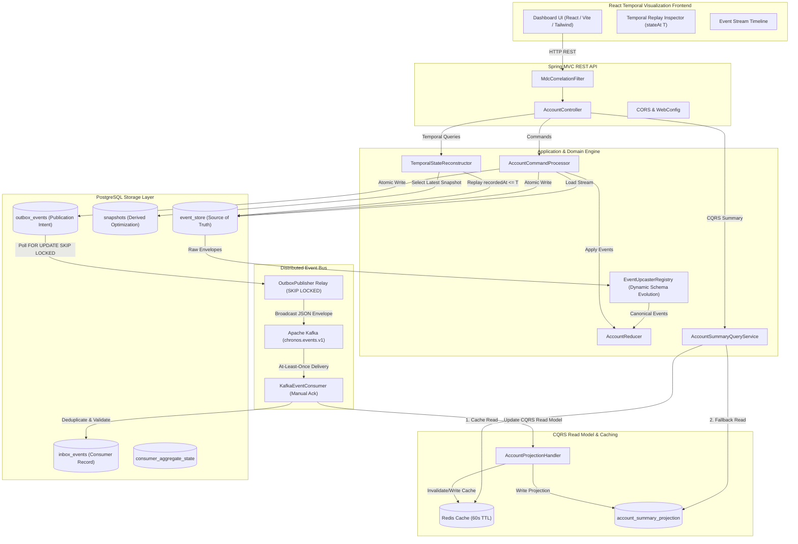
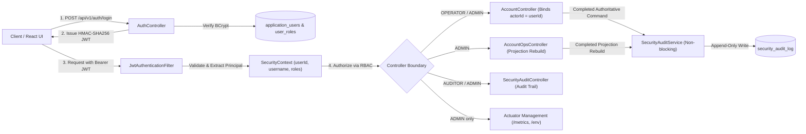

# Chronos Engine v1.0
> **Time-Traveling State Reconstruction Engine with Transactional Event Sourcing, Asynchronous Kafka Broadcast, CQRS Read Model Caching, and React Temporal Visualization Dashboard.**

[](https://github.com/saishsanas/chronos/actions/workflows/ci.yml)
[](https://openjdk.org/projects/jdk/21/)
[](https://spring.io/projects/spring-boot)
[](https://www.postgresql.org/)
[](https://kafka.apache.org/)
[](https://redis.io/)
[](https://react.dev/)

---

## 1. Project Purpose
Traditional CRUD financial applications suffer from state mutability, audit trail destruction, and lack of temporal visibility into historical system states. **Chronos** solves these challenges by implementing an immutable **Event Sourcing** architecture with **Snapshot Optimization**, **Transactional Outbox Messaging**, **Idempotent Kafka Consumer Processing**, **CQRS Read Model Projections with Redis Caching**, and **Inclusive Temporal State Reconstruction (`stateAt(T)`)** served via a **Dark-First React Observability Dashboard**.

---

## 2. High-Level Architecture



---

## 3. Core Architectural Guarantees

| Guarantee | Mechanism / Implementation |
| :--- | :--- |
| **Immutable Source of Truth** | The `event_store` table is append-only. Events are never modified or deleted. |
| **Deterministic Schema Upcasting** | Dynamic in-memory migration of legacy events (v1 -> v2) via `EventUpcasterRegistry` while strictly preserving raw event store immutability. |
| **Database-Enforced Command Idempotency** | Unique constraint on `(actor_id, idempotency_key)` in `command_idempotency` with SHA-256 fingerprinting prevents race conditions and returns original results without duplicate event creation. Conflict reuse triggers HTTP 409. |
| **Projection Rebuild & Atomic Cutover** | Zero-downtime projection rebuild from `event_store` via `account_summary_projection_staging` and atomic transaction swap (`TRUNCATE` + `INSERT SELECT`). Flushes Redis cache on activation. |
| **Poison Event Quarantine** | Malformed Kafka payloads transition to `QUARANTINED` status in `inbox_events` with error details, preventing infinite consumer retries while unblocking the event bus. |
| **Optimistic Concurrency Control (OCC)** | Aggregate versioning prevents sequence drift and lost updates under concurrent commands. |
| **Inclusive Temporal Replay** | `stateAt(T)` reconstructs exact aggregate state for events where `recordedAt <= T`. |
| **Atomic Outbox Publication** | `event_store` and `outbox_events` are populated in **one single PostgreSQL database transaction**. |
| **Lock-Free Outbox Polling** | Outbox relay uses `FOR UPDATE SKIP LOCKED` for non-blocking concurrent worker scaling. |
| **Inbox Consumer Idempotency** | `inbox_events` table with unique `event_id` constraint guarantees at-least-once Kafka transport is effectively idempotent at the consumer boundary. |
| **CQRS Read Model Caching** | Low-latency `GET /summary` query via Redis cache (60s TTL) with automatic fallback to PostgreSQL. |
| **Visual Temporal Audit** | React frontend provides interactive time-travel replay, sequence timeline, and JSON envelope inspection. |

---

## 4. Technology Stack
- **Backend:** Java 21 LTS, Spring Boot 3.3.4 (MVC, JDBC, Kafka, Redis, Actuator, Validation)
- **Frontend:** React 19, Vite, TypeScript 5.6, Tailwind CSS, Lucide Icons
- **Database & Migration:** PostgreSQL 16, Flyway Migration (`V1` to `V10`)
- **Security & Auth:** Spring Security 6.3, Nimbus JOSE JWT (HMAC-SHA256), BCrypt Password Hashing, RBAC
- **Messaging & Cache:** Apache Kafka 7.6.0 (KRaft mode), Redis 7
- **Documentation & Metrics:** SpringDoc OpenAPI 2.6.0 (Swagger UI Bearer JWT), Micrometer Telemetry
- **Containerization & CI:** Docker, Docker Compose, GitHub Actions

---

## 5. Security Architecture & RBAC

Chronos implements enterprise-grade, defense-in-depth security designed for financial core systems:



### Role-Based Access Control (RBAC) Matrix

| Endpoint / Resource | Anonymous | `OPERATOR` | `AUDITOR` | `ADMIN` |
| :--- | :---: | :---: | :---: | :---: |
| `POST /api/v1/auth/login` | Permit | Permit | Permit | Permit |
| `GET /actuator/health`, `/actuator/info` | Permit | Permit | Permit | Permit |
| `GET /api/v1/accounts/**` (State & Events) | Deny (401) | Allow | Allow | Allow |
| `POST /api/v1/accounts/**` (Financial Commands) | Deny (401) | Allow | Deny (403) | Allow |
| `POST /api/v1/ops/projections/**` (Rebuild Projections) | Deny (401) | Deny (403) | Deny (403) | Allow |
| `GET /api/v1/ops/audit` (Security Audit Log) | Deny (401) | Deny (403) | Allow | Allow |
| `/actuator/**` (Metrics, Env, Beans, etc.) | Deny (401) | Deny (403) | Deny (403) | Allow |

### Actor Identity Binding
When an authenticated operator or admin executes financial commands:
- `CommandContext.actorId` is **authoritatively bound** to the verified user's immutable `userId` UUID from the JWT subject (`principal.userId().toString()`).
- Clients cannot spoof actor identities or tamper with idempotency deduplication scopes (`actor_id`, `idempotency_key`).
- Domain event contracts and reducer state transitions remain pure, deterministic, and security-agnostic.

### Resilient Append-Only Audit Logging
- Security events (`LOGIN_SUCCESS`, `LOGIN_FAILURE`, `ACCOUNT_COMMAND`, `PROJECTION_REBUILD`, `ACCESS_DENIED`) are durably recorded to PostgreSQL `security_audit_log`.
- In accordance with financial event sourcing principles, `event_store` is the sole authoritative source of truth. Audit persistence runs with decoupled try-catch boundary; failure to persist an audit log records an error metric (`chronos.security.audit.write.failure`) without aborting or rolling back financial transactions.

---

## 6. Local Development Credentials (DEV / TEST ONLY)

> [!WARNING]
> The credentials below are provisioned **strictly for local development and integration testing** when `chronos.security.bootstrap-dev-users: true` is explicitly configured. Production configurations default this property to `false` and require external user directory management.

| Username | Default Password | Assigned Roles | Scope |
| :--- | :--- | :--- | :--- |
| `admin` | `AdminSecret123!` | `ROLE_ADMIN` | Full administrative control, projection rebuilds, audit reviews, sensitive actuator access |
| `operator` | `OperatorSecret123!` | `ROLE_OPERATOR` | Account creation, deposits, withdrawals, freezes, transaction limits |
| `auditor` | `AuditorSecret123!` | `ROLE_AUDITOR` | Read-only ledger verification, temporal inspector replay, security audit logs |

---

## 7. REST API Reference

### Authentication
- `POST /api/v1/auth/login` — Authenticate with username and password, returns Bearer JWT with roles and expiration

### Financial Command Endpoints (Requires `OPERATOR` or `ADMIN`)
- `POST /api/v1/accounts` — Create a new account aggregate
- `POST /api/v1/accounts/{id}/deposits` — Deposit funds into account
- `POST /api/v1/accounts/{id}/withdrawals` — Withdraw funds (enforces transaction & overdraft limits)
- `POST /api/v1/accounts/{id}/freeze` — Freeze account (prevents withdrawals)
- `POST /api/v1/accounts/{id}/unfreeze` — Unfreeze account
- `PUT /api/v1/accounts/{id}/limits/overdraft` — Change overdraft limit
- `PUT /api/v1/accounts/{id}/limits/transaction` — Change transaction limit
- `POST /api/v1/accounts/{id}/corrections` — Issue financial reversal/adjustment correction
- `POST /api/v1/accounts/{id}/close` — Close zero-balance account

### Query & Temporal Endpoints (Requires `OPERATOR`, `AUDITOR`, or `ADMIN`)
- `GET /api/v1/accounts/{id}` — Reconstruct current state from snapshot and event stream
- `GET /api/v1/accounts/{id}/summary` — CQRS read model summary (Redis cached with PostgreSQL fallback)
- `GET /api/v1/accounts/{id}/state-at?at=<ISO-8601>` — Reconstruct historical state at timestamp $T$ (`recordedAt <= T`)
- `GET /api/v1/accounts/{id}/events` — Fetch full immutable event history (`ORDER BY sequenceNumber ASC`)

### Operations & Security Audit (Requires `ADMIN` / `AUDITOR`)
- `POST /api/v1/ops/projections/account-summary/rebuild` — Trigger zero-downtime projection rebuild (`ADMIN` only)
- `GET /api/v1/ops/audit` — Query bounded security audit log trail (`ADMIN` or `AUDITOR`)

---

## 8. Swagger UI & Bearer JWT Testing

1. Open **Swagger UI**: [http://localhost:8080/swagger-ui.html](http://localhost:8080/swagger-ui.html)
2. Expand `POST /api/v1/auth/login`, click **Try it out**, and log in with your credentials (e.g., `operator` / `OperatorSecret123!`).
3. Copy the returned `token` string from the JSON response.
4. Click the green **Authorize** button at the top right of the Swagger UI page.
5. In the **Value** field, paste the token (or `Bearer <token>`) and click **Authorize**.
6. All subsequent command and query endpoints will execute with the authenticated Bearer token.

---

## 9. Application Entry Points & Observability

### Endpoints & Security Posture
- **Temporal Dashboard UI (React):** [http://localhost:5173](http://localhost:5173)
- **Interactive Swagger UI:** [http://localhost:8080/swagger-ui.html](http://localhost:8080/swagger-ui.html)
- **Health Check (Public):** [http://localhost:8080/actuator/health](http://localhost:8080/actuator/health)
- **Application Info (Public):** [http://localhost:8080/actuator/info](http://localhost:8080/actuator/info)
- **Operational Metrics (`ADMIN` only):** [http://localhost:8080/actuator/metrics](http://localhost:8080/actuator/metrics)

### Security Metrics (Micrometer)
- `chronos.security.login.success` — Counter of successful user authentications
- `chronos.security.login.failure` — Counter of failed authentication attempts
- `chronos.security.access.denied` — Counter of RBAC authorization rejections (HTTP 403)
- `chronos.security.audit.write.failure` — Counter of failed security audit log persistence attempts

---

## 10. Local Execution & Test Guide

### Prerequisites
- JDK 21
- Node.js v22+ & npm 10+
- Maven 3.9+
- Docker & Docker Compose

### 1. Run Complete Test Suite (172 Tests)
```bash
mvn clean test
```
> [!NOTE]
> Requires JDK 21. If multiple Java versions are installed on your workstation, configure your `JAVA_HOME` environment variable to point to your JDK 21 installation prior to running Maven.

### 2. Run Frontend Build
```bash
cd frontend
npm install
npm run build
cd ..
```

### 3. Run Full System via Docker Compose
```bash
# Set a 256-bit JWT signing secret for local environment
export CHRONOS_JWT_SECRET="dev-insecure-only-secret-for-chronos-docker-compose-minimum-256-bits-ok!"
# On Windows PowerShell: $env:CHRONOS_JWT_SECRET="dev-insecure-only-secret-for-chronos-docker-compose-minimum-256-bits-ok!"

docker compose up --build
```
Once initialized, access the dashboard, Swagger UI, and health check via the URLs listed in [Section 9 (Application Entry Points & Observability)](#9-application-entry-points--observability).

---

## 11. Performance Benchmarking & Scale Validation (Wave 4)

Chronos includes an isolated, reproducible performance benchmark harness that empirically measures the engine under growing volume (10k, 50k, 100k events), diverse access patterns, and concurrent load without modifying or bypassing Waves 1–3 correctness, OCC, or security boundaries.

### Benchmark Highlights (100k Scale Baseline)
- **Full Replay**: 100,000 events replayed from PostgreSQL in **615.9 ms** (~162,350 events/sec sustained throughput).
- **Snapshot Acceleration**: 90% snapshot placement avoids 90,000 tail events, hydrating state in **60.2 ms** (**10.2x wall-clock speedup**).
- **Zero-Downtime Projection Rebuild**: Rebuilding read model across 500 accounts (100,000 events) completes in **1.42 seconds** via staging tables and atomic live cutover.
- **CQRS Read Model Latency**: Low-latency Redis cache reads (**1.45 ms**) vs PostgreSQL projection reads (**1.13 ms** direct / **4.38 ms** on miss + fallback).
- **OCC Under Contention**: 8 concurrent workers executing transactions against a single account achieve clean serialized commits while rejecting 68 expected race collisions via `OptimisticConcurrencyException` without sequence drift.
- **In-Memory Schema Evolution**: Legacy v1 $\to$ v2 upcasting overhead measured at **74 ns/event** via JMH 1.37 while strictly maintaining raw PostgreSQL event store immutability.

### Running Benchmarks
Benchmarks are isolated in `chronos_bench_db` and do not run during standard correctness builds:
```powershell
# Run primary benchmark suite (10k, 50k, 100k events)
.\scripts\run-benchmarks.ps1
```

For full methodology, statistical analysis, environment profile, and raw metrics tables, see the [Wave 4 Benchmark Report](docs/performance/WAVE4_BENCHMARK_REPORT.md).

---

## 12. License
Apache License 2.0. Built for production demonstration and technical portfolio review.


