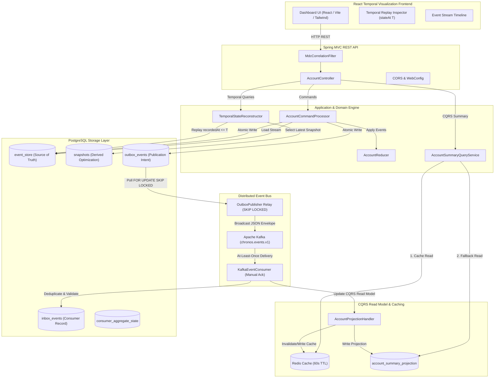

# Chronos Engine v1.0
> **Time-Traveling State Reconstruction Engine with Transactional Event Sourcing, Asynchronous Kafka Broadcast, CQRS Read Model Caching, and React Temporal Visualization Dashboard.**

[](https://github.com/saish/chronos-engine/actions/workflows/ci.yml)
[](https://openjdk.org/projects/jdk/21/)
[](https://spring.io/projects/spring-boot)
[](https://www.postgresql.org/)
[](https://kafka.apache.org/)
[](https://redis.io/)
[](https://react.dev/)

---

## 1. Project Purpose
Traditional CRUD financial applications suffer from state mutability, audit trail destruction, and lack of temporal visibility into historical system states. **Chronos** solves these challenges by implementing an immutable **Event Sourcing** architecture with **Snapshot Optimization**, **Transactional Outbox Messaging**, **Idempotent Kafka Consumer Processing**, **CQRS Read Model Projections with Redis Caching**, and **Inclusive Temporal State Reconstruction (`stateAt(T)`)** served via a **Dark-First React Observability Dashboard**.

---

## 2. High-Level Architecture



---

## 3. Core Architectural Guarantees

| Guarantee | Mechanism / Implementation |
| :--- | :--- |
| **Immutable Source of Truth** | The `event_store` table is append-only. Events are never modified or deleted. |
| **Optimistic Concurrency Control (OCC)** | Aggregate versioning prevents sequence drift and lost updates under concurrent commands. |
| **Inclusive Temporal Replay** | `stateAt(T)` reconstructs exact aggregate state for events where `recordedAt <= T`. |
| **Atomic Outbox Publication** | `event_store` and `outbox_events` are populated in **one single PostgreSQL database transaction**. |
| **Lock-Free Outbox Polling** | Outbox relay uses `FOR UPDATE SKIP LOCKED` for non-blocking concurrent worker scaling. |
| **Idempotent Kafka Consumption** | `inbox_events` table with unique `event_id` constraint guarantees **no duplicate business execution**. |
| **CQRS Read Model Caching** | Low-latency `GET /summary` query via Redis cache (60s TTL) with automatic fallback to PostgreSQL. |
| **Visual Temporal Audit** | React frontend provides interactive time-travel replay, sequence timeline, and JSON envelope inspection. |

---

## 4. Technology Stack
- **Backend:** Java 21 LTS, Spring Boot 3.3.4 (MVC, JDBC, Kafka, Redis, Actuator, Validation)
- **Frontend:** React 19, Vite, TypeScript 5.6, Tailwind CSS, Lucide Icons
- **Database & Migration:** PostgreSQL 16, Flyway Migration (`V1` to `V5`)
- **Messaging & Cache:** Apache Kafka 7.6.0 (KRaft mode), Redis 7
- **Documentation & Metrics:** SpringDoc OpenAPI 2.6.0 (Swagger UI), Micrometer Telemetry
- **Containerization & CI:** Docker, Docker Compose, GitHub Actions

---

## 5. REST API Reference

### Command Endpoints
- `POST /api/v1/accounts` — Create a new account aggregate
- `POST /api/v1/accounts/{id}/deposits` — Deposit funds into account
- `POST /api/v1/accounts/{id}/withdrawals` — Withdraw funds (enforces transaction & overdraft limits)
- `POST /api/v1/accounts/{id}/freeze` — Freeze account (prevents withdrawals)
- `POST /api/v1/accounts/{id}/unfreeze` — Unfreeze account
- `PUT /api/v1/accounts/{id}/limits/overdraft` — Change overdraft limit
- `PUT /api/v1/accounts/{id}/limits/transaction` — Change transaction limit
- `POST /api/v1/accounts/{id}/corrections` — Issue financial reversal/adjustment correction
- `POST /api/v1/accounts/{id}/close` — Close zero-balance account

### Query & Temporal Endpoints
- `GET /api/v1/accounts/{id}` — Reconstruct current state from snapshot and event stream
- `GET /api/v1/accounts/{id}/summary` — CQRS read model summary (Redis cached with PostgreSQL fallback)
- `GET /api/v1/accounts/{id}/state-at?at=<ISO-8601>` — Reconstruct historical state at timestamp $T$ (`recordedAt <= T`)
- `GET /api/v1/accounts/{id}/events` — Fetch full immutable event history (`ORDER BY sequenceNumber ASC`)

---

## 6. Observability & Telemetry

### Spring Boot Actuator & UI Dashboard
- **React UI Dashboard:** [http://localhost:5173](http://localhost:5173) (or Docker container port `5173`)
- **Swagger UI:** [http://localhost:8080/swagger-ui.html](http://localhost:8080/swagger-ui.html)
- **Health Check:** [http://localhost:8080/actuator/health](http://localhost:8080/actuator/health)
- **Operational Metrics:** [http://localhost:8080/actuator/metrics](http://localhost:8080/actuator/metrics)

---

## 7. Local Execution & Demo Guide

### Prerequisites
- JDK 21
- Node.js v22+ & npm 10+
- Maven 3.9+
- Docker & Docker Compose

### 1. Run Backend Unit & Integration Tests (97 Passing Tests)
```bash
$env:JAVA_HOME="C:\Program Files\Eclipse Adoptium\jdk-21.0.11.10-hotspot\"
mvn clean test
```

### 2. Run Frontend Build
```bash
cd frontend
npm install
npm run build
```

### 3. Run Full System via Docker Compose
```bash
docker compose up --build
```
Once started, access:
- **Temporal Dashboard UI:** [http://localhost:5173](http://localhost:5173)
- **Swagger UI:** [http://localhost:8080/swagger-ui.html](http://localhost:8080/swagger-ui.html)
- **Backend Actuator Health:** [http://localhost:8080/actuator/health](http://localhost:8080/actuator/health)

---

## 8. License
Apache License 2.0. Built for production demonstration and technical portfolio review.
