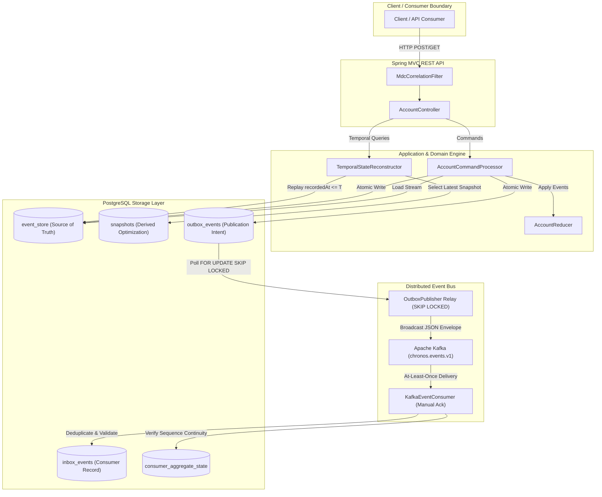

# Chronos Engine
> **Time-Traveling State Reconstruction Engine with Transactional Event Sourcing, Asynchronous Kafka Broadcast, and Idempotent Consumer Processing.**

[](https://github.com/saish/chronos-engine/actions/workflows/ci.yml)
[](https://openjdk.org/projects/jdk/21/)
[](https://spring.io/projects/spring-boot)
[](https://www.postgresql.org/)
[](https://kafka.apache.org/)

---

## 1. Project Purpose
Traditional CRUD financial applications suffer from state mutability, audit trail destruction, and lack of temporal visibility into historical system states. **Chronos** solves these challenges by implementing an immutable **Event Sourcing** architecture with **Snapshot Optimization**, **Transactional Outbox Messaging**, **Idempotent Kafka Consumer Processing**, and **Inclusive Temporal State Reconstruction (`stateAt(T)`)**.

---

## 2. High-Level Architecture



---

## 3. Core Architectural Guarantees

| Guarantee | Mechanism / Implementation |
| :--- | :--- |
| **Immutable Source of Truth** | The `event_store` table is append-only. Events are never modified or deleted. |
| **Optimistic Concurrency Control (OCC)** | Aggregate versioning prevents sequence drift and lost updates under concurrent commands. |
| **Inclusive Temporal Replay** | `stateAt(T)` reconstructs exact aggregate state for events where `recordedAt <= T`. |
| **Atomic Outbox Publication** | `event_store` and `outbox_events` are populated in **one single PostgreSQL database transaction**. |
| **Lock-Free Outbox Polling** | Outbox relay uses `FOR UPDATE SKIP LOCKED` for non-blocking concurrent worker scaling. |
| **Idempotent Kafka Consumption** | `inbox_events` table with unique `event_id` constraint guarantees **no duplicate business execution**. |
| **Sequence Continuity Validation** | `consumer_aggregate_state` detects sequence gaps, regressions, and collisions. |

---

## 4. Technology Stack
- **Language:** Java 21 LTS
- **Framework:** Spring Boot 3.3.4 (Spring MVC, JDBC, Kafka, Validation, Actuator)
- **Database & Migration:** PostgreSQL 16.15, Flyway Migration (`V1` to `V4`)
- **Messaging:** Apache Kafka 7.6.0 (KRaft mode)
- **Documentation:** SpringDoc OpenAPI 2.6.0 (Swagger UI)
- **Observability:** Micrometer, SLF4J MDC Correlation Filter
- **Containers & CI:** Docker, Docker Compose, GitHub Actions

---

## 5. REST API Reference

### Command Endpoints
- `POST /api/v1/accounts` — Create a new account aggregate
- `POST /api/v1/accounts/{id}/deposits` — Deposit funds into account
- `POST /api/v1/accounts/{id}/withdrawals` — Withdraw funds (enforces transaction & overdraft limits)
- `POST /api/v1/accounts/{id}/freeze` — Freeze account (prevents withdrawals)
- `POST /api/v1/accounts/{id}/unfreeze` — Unfreeze account
- `PUT /api/v1/accounts/{id}/limits/overdraft` — Change overdraft limit
- `PUT /api/v1/accounts/{id}/limits/transaction` — Change transaction limit
- `POST /api/v1/accounts/{id}/corrections` — Issue financial reversal/adjustment correction
- `POST /api/v1/accounts/{id}/close` — Close zero-balance account

### Query & Temporal Endpoints
- `GET /api/v1/accounts/{id}` — Reconstruct current state from snapshot and event stream
- `GET /api/v1/accounts/{id}/state-at?at=<ISO-8601>` — Reconstruct historical state at timestamp $T$ (`recordedAt <= T`)
- `GET /api/v1/accounts/{id}/events` — Fetch full immutable event history (`ORDER BY sequenceNumber ASC`)

### Request Headers
- `X-Correlation-Id` (Optional): Propagates operational correlation ID into logs and event metadata.
- `Idempotency-Key` (Optional): Propagates client idempotency key into event metadata.

---

## 6. Observability & Telemetry

### Spring Boot Actuator
- Health Check: [http://localhost:8080/actuator/health](http://localhost:8080/actuator/health)
- Liveness Probe: `http://localhost:8080/actuator/health/liveness`
- Readiness Probe: `http://localhost:8080/actuator/health/readiness`
- Operational Metrics: [http://localhost:8080/actuator/metrics](http://localhost:8080/actuator/metrics)

### Custom Micrometer Metrics
- `chronos.commands.processed`: Counter for successful commands (tag: `command`)
- `chronos.commands.failed`: Counter for failed commands (tags: `command`, `outcome`)
- `chronos.temporal.reconstruction`: Counter for temporal state queries (tag: `snapshotUsed`)
- `chronos.outbox.published`: Counter for successfully published outbox events
- `chronos.inbox.duplicates`: Counter for suppressed duplicate Kafka deliveries

---

## 7. Local Execution & Demo Guide

### Prerequisites
- JDK 21
- Maven 3.9+
- Docker & Docker Compose (optional for local container execution)

### 1. Run Unit & Integration Tests
```bash
mvn clean test
```

### 2. Run Locally via Docker Compose
```bash
docker compose up --build
```
Once started, access:
- **Swagger UI:** [http://localhost:8080/swagger-ui.html](http://localhost:8080/swagger-ui.html)
- **OpenAPI Spec:** [http://localhost:8080/v3/api-docs](http://localhost:8080/v3/api-docs)
- **Actuator Health:** [http://localhost:8080/actuator/health](http://localhost:8080/actuator/health)

### 3. Demo Walkthrough Sequence (via Swagger UI or cURL)
1. **Create Account:** `POST /api/v1/accounts` with payload `{"currency":"INR", "initialOverdraftLimitMinor":10000, "initialTransactionLimitMinor":50000}`.
2. **Deposit:** `POST /api/v1/accounts/{id}/deposits` with payload `{"amountMinor": 25000}`.
3. **Withdraw:** `POST /api/v1/accounts/{id}/withdrawals` with payload `{"amountMinor": 5000}`.
4. **Query Current State:** `GET /api/v1/accounts/{id}` $\rightarrow$ Balance shows `20000`.
5. **Query Historical State:** `GET /api/v1/accounts/{id}/state-at?at=<TIMESTAMP_BEFORE_WITHDRAWAL>` $\rightarrow$ Balance shows `25000`.
6. **View Event Stream:** `GET /api/v1/accounts/{id}/events` $\rightarrow$ Lists all domain event envelopes.

---

## 8. License
Apache License 2.0. Built for production demonstration and technical portfolio review.
